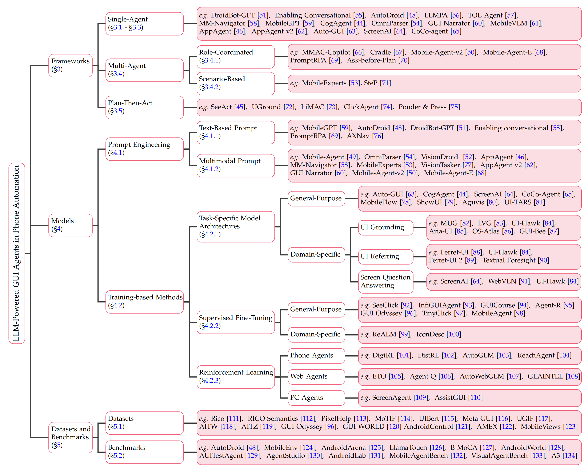

# LLM-Powered GUI Agents in Phone Automation: Surveying Progress and Prospects

[](https://github.com/sindresorhus/awesome)
[](https://github.com/PhoneLLM/Awesome-LLM-Powered-Phone-GUI-Agents/stargazers)
[](https://github.com/PhoneLLM/Awesome-LLM-Powered-Phone-GUI-Agents/network)

[](https://github.com/PhoneLLM/Awesome-LLM-Powered-Phone-GUI-Agents/issues)
[](https://github.com/PhoneLLM/Awesome-LLM-Powered-Phone-GUI-Agents/pulls)
[](https://github.com/PhoneLLM/Awesome-LLM-Powered-Phone-GUI-Agents/graphs/contributors)
[](https://opensource.org/licenses/Apache-2.0)

## 🚀 News
- 🤩 [2025/03/13] We have updated the [Paper List](#-paper-list) again! We will update once a week from now on. We welcome your continued interest in our work!
- 🎉 [2025/02/21] We have updated the [Paper List](#-paper-list)! The new version of our survey will be released later.
- 💥 [2025/01/07] Our survey is released! See [LLM-Powered GUI Agents in Phone Automation: Surveying Progress and Prospects](https://www.preprints.org/manuscript/202501.0413/v1) for the paper!
- ✨ [2024/12/29] We create this repository to maintain a paper list on LLM-Powered Phone GUI Agents. More papers are coming soon!

## 📑 Citation
If you find our survey useful for your research and applications, please cite using this BibTeX:
```
@article{liu2025llm,
  title={Llm-powered gui agents in phone automation: Surveying progress and prospects},
  author={Liu, William and Liu, Liang and Guo, Yaxuan and Xiao, Han and Lin, Weifeng and Chai, Yuxiang and Ren, Shuai and Liang, Xiaoyu and Li, Linghao and Wang, Wenhao and others},
  year={2025},
  publisher={Preprints}
}
```
## 📖 Introduction

🔥 **Must-read papers for LLM-Powered Phone GUI Agents.**

**We greatly appreciate any contributions via PRs, issues, emails, or other methods.**

## 🔖 General Overview
A comprehensive taxonomy of LLM-powered phone GUI agents in phone automation. 
Note that only a selection of representative works is included in this categorization.



## 🪧 Milestones
Milestones in the development of LLM-powered phone GUI agents. 
This figure divides advancements into four primary parts: 
**Prompt Engineering**, **Training-Based Methods**, **Datasets** and **Benchmarks**. 
Prompt Engineering leverages pre-trained LLMs by strategically crafting input prompts, to perform specific tasks without modifying model parameters. 
In contrast, Training-Based Methods, involve adapting LLMs via supervised fine-tuning or reinforcement learning on GUI-specific data, 
thereby enhancing their ability to understand and interact with mobile UIs.


## 📝 Table of Content (ToC)

- [LLM-Powered GUI Agents in Phone Automation: Surveying Progress and Prospects](#llm-powered-gui-agents-in-phone-automation-surveying-progress-and-prospects)
  - [🚀 News](#-news)
  - [📖 Introduction](#-introduction)
  - [🔖 General Overview](#-general-overview)
  - [🪧 Milestones](#-milestones)
  - [📝 Table of Content (ToC)](#-table-of-content-toc)
  - [🔍 Paper List](#-paper-list)
    - [Frameworks and Components of Phone GUI Agents](#frameworks-and-components-of-phone-gui-agents)
      - [Single-Agent Frameworks](#single-agent-frameworks)
      - [Multi-Agent Frameworks](#multi-agent-frameworks)
      - [Plan-Then-Act Frameworks](#plan-then-act-frameworks)
    - [LLMs for Phone Automation](#llms-for-phone-automation)
      - [Prompt Engineering](#prompt-engineering)
        - [Text-Based Prompt](#text-based-prompt)
        - [Multimodal Prompt](#multimodal-prompt)
      - [Training-Based Methods](#training-based-methods)
        - [Task-Specific LLM-based Agents](#task-specific-llm-based-agents)
        - [Supervised Fine-Tuning Methods for Phone GUI Agents](#supervised-fine-tuning-methods-for-phone-gui-agents)
        - [Reinforcement Learning Methods for Phone GUI Agents](#reinforcement-learning-methods-for-phone-gui-agents)
    - [Datasets and Benchmarks](#datasets-and-benchmarks)
      - [Datasets](#datasets)
      - [Benchmarks](#benchmarks)
  - [🌟 Star History](#-star-history)

## 🔍 Paper List
### Frameworks and Components of Phone GUI Agents
#### Single-Agent Frameworks

| Date    | Method                                                                                                                                    | Project                                                       |
|---------|-------------------------------------------------------------------------------------------------------------------------------------------|---------------------------------------------------------------|
| 2025.02 | [A-MEM: Agentic Memory for LLM Agents](https://arxiv.org/abs/2502.12110)                                                                  | [Code](https://github.com/agiresearch/A-mem)                  |
| 2024.09 | [MobileVLM: A Vision-Language Model for Better Intra- and Inter-UI Understanding](https://arxiv.org/abs/2409.14818)                       | [Code](https://github.com/XiaoMi/mobilevlm)                   |
| 2024.08 | [AppAgent v2: Advanced Agent for Flexible Mobile Interactions](https://arxiv.org/abs/2408.11824)                                          | N/A                                                           |
| 2024.08 | [OpenWebAgent: An open toolkit to enable web agents on large language models](https://aclanthology.org/2024.acl-demos.8/)                 | [Code](https://github.com/THUDM/OpenWebAgent)                 |
| 2024.08 | [Caution for the Environment: Multimodal Agents are Susceptible to Environmental Distractions](https://arxiv.org/abs/2408.02544)          | [Code](https://github.com/xbmxb/EnvDistraction)               |
| 2024.08 | [OmniParser for Pure Vision Based GUI Agent](https://arxiv.org/abs/2408.00203)                                                            | N/A                                                           |
| 2024.07 | [Enhancing Mobile "How-to" Queries with Automated Search Results Verification and Reranking](https://openreview.net/forum?id=EaSKCja3rr)  | N/A                                                           |
| 2024.06 | [Read Anywhere Pointed: Layout-aware GUI Screen Reading with Tree-of-Lens Grounding](https://arxiv.org/abs/2406.19263)                    | [Code](https://github.com/eric-ai-lab/Screen-Point-and-Read)  |
| 2024.06 | [GUI Action Narrator: Where and When Did That Action Take Place?](https://arxiv.org/abs/2406.13719)                                       | [Code](https://showlab.github.io/GUI-Narrator/)               |
| 2024.02 | [CoCo-agent: A comprehensive cognitive MLLM agent for smartphone GUI automation](https://arxiv.org/abs/2402.11941)                        | [Code](https://github.com/xbmxb/CoCo-Agent)                   |
| 2024.02 | [ScreenAI: A Vision-Language Model for UI and Infographics Understanding](https://arxiv.org/abs/2402.04615)                               | [Code](https://github.com/google-research-datasets/screen_qa) |
| 2023.12 | [AppAgent: Multimodal Agents as Smartphone Users](https://arxiv.org/abs/2312.13771)                                                       | [Code](https://github.com/TencentQQGYLab/AppAgent)            |
| 2023.12 | [CogAgent: A Visual Language Model for GUI Agents](https://arxiv.org/abs/2312.08914)                                                      | [Code](https://github.com/THUDM/CogVLM)                       |
| 2023.12 | [Intelligent virtual assistants with llm-based process automation](https://arxiv.org/abs/2312.06677)                                      | N/A                                                           |
| 2023.12 | [Explore, Select, Derive, and Recall: Augmenting LLM with Human-like Memory for Mobile Task Automation](https://arxiv.org/abs/2312.03003) | [Code](https://github.com/mobilegptsys/MobileGPT)             |
| 2023.11 | [GPT-4V in Wonderland: Large Multimodal Models for Zero-Shot Smartphone GUI Navigation](https://arxiv.org/abs/2311.07562)                 | [Code](https://github.com/zzxslp/MM-Navigator)                |
| 2023.09 | [AutoDroid: LLM-powered Task Automation in Android](https://arxiv.org/abs/2308.15272)                                                     | [Code](https://github.com/MobileLLM/AutoDroid)                |
| 2023.09 | [You Only Look at Screens: Multimodal Chain-of-Action Agents](https://arxiv.org/abs/2309.11436)                                           | [Code](https://github.com/cooelf/Auto-GUI)                    |
| 2023.04 | [DroidBot-GPT: GPT-powered UI Automation for Android](https://arxiv.org/abs/2304.07061)                                                   | [Code](https://github.com/MobileLLM/AutoDroid)                |
| 2023.04 | [Enabling Conversational Interaction with Mobile UI using Large Language Models](https://dl.acm.org/doi/full/10.1145/3544548.3580895)     | N/A                                                           |

#### Multi-Agent Frameworks

| Date    | Method                                                                                                                                          | Project                                                  |
|---------|-------------------------------------------------------------------------------------------------------------------------------------------------|----------------------------------------------------------|
| 2025.03 | [CAMEL: Communicative Agents for "Mind" Exploration of Large Language Model Society](https://arxiv.org/abs/2303.17760 )                         | [Code](https://github.com/camel-ai/owl )                 |
| 2025.02 | [Multi-Agent Design: Optimizing Agents with Better Prompts and Topologies](https://arxiv.org/abs/2502.02533 )                                   | N/A                                                      |
| 2025.01 | [Mobile-Agent-E: Self-Evolving Mobile Assistant for Complex Tasks](https://arxiv.org/abs/2501.11733 )                                           | [Code](https://github.com/X-PLUG/MobileAgent )           |
| 2024.07 | [MobileExperts: A Dynamic Tool-Enabled Agent Team in Mobile Devices](https://arxiv.org/abs/2407.03913 )                                         | N/A                                                      |
| 2024.07 | [Cradle: Empowering Foundation Agents Towards General Computer Control](https://arxiv.org/abs/2403.03186 )                                      | [Code](https://baai-agents.github.io/Cradle/ )           |
| 2024.07 | [Agent-E: From Autonomous Web Navigation to Foundational Design Principles in Agentic Systems](https://arxiv.org/abs/2407.13032 )               | [Code](https://github.com/EmergenceAI/Agent-E )          |
| 2024.06 | [Ask-before-Plan: Proactive Language Agents for Real-World Planning](https://arxiv.org/abs/2406.12639 )                                         | [Code](https://github.com/magicgh/Ask-before-Plan )      |
| 2024.06 | [Mobile-Agent-v2: Mobile Device Operation Assistant with Effective Navigation via Multi-Agent Collaboration](https://arxiv.org/abs/2406.01014 ) | [Code](https://github.com/X-PLUG/MobileAgent )           |
| 2024.04 | [MMAC-Copilot: Multi-modal Agent Collaboration Operating System Copilot](https://arxiv.org/abs/2404.18074 )                                     | N/A                                                      |
| 2024.04 | [PromptRPA: Generating Robotic Process Automation on Smartphones from Textual Prompts](https://arxiv.org/abs/2404.02475 )                       | N/A                                                      |
| 2024.02 | [UFO: A UI-Focused Agent for Windows OS Interaction](https://arxiv.org/abs/2402.07939 )                                                         | [Code](https://github.com/microsoft/UFO )                |
| 2024.02 | [OS-Copilot: Towards Generalist Computer Agents with Self-Improvement](https://arxiv.org/abs/2402.07456 )                                       | [Code](https://github.com/OS-Copilot/OS-Copilot )        |
| 2023.10 | [SteP: Stacked LLM Policies for Web Actions](https://arxiv.org/abs/2310.03720 )                                                                 | [Code](https://github.com/asappresearch/webagents-step ) |

#### Plan-Then-Act Frameworks

| Date    | Method                                                                                                                          | Project                                                     |
|---------|---------------------------------------------------------------------------------------------------------------------------------|-------------------------------------------------------------|
| 2025.03 | [CHOP: Mobile Operating Assistant with Constrained High-frequency Optimized Subtask Planning](https://arxiv.org/abs/2503.03743) | [Code](https://github.com/Yuqi-Zhou/CHOP)                   |
| 2024.12 | [Ponder & Press: Advancing Visual GUI Agent towards General Computer Control](https://arxiv.org/abs/2412.01268 )                | [Code](https://invinciblewyq.github.io/ponder-press-page/)  |
| 2024.10 | [ClickAgent: Enhancing UI Location Capabilities of Autonomous Agents](https://arxiv.org/abs/2410.11872)                         | [Code](https://github.com/Samsung/ClickAgent)               |
| 2024.10 | [Lightweight Neural App Control](https://arxiv.org/abs/2410.17883)                                                              | N/A                                                         |
| 2024.10 | [Navigating the Digital World as Humans Do: Universal Visual Grounding for GUI Agents](https://arxiv.org/abs/2410.05243)        | [Code](https://github.com/OSU-NLP-Group/UGround)            |
| 2024.01 | [GPT-4V(ision) is a Generalist Web Agent, if Grounded](https://arxiv.org/abs/2401.01614)                                        | [Code](https://github.com/OSU-NLP-Group/SeeAct)             |

### LLMs for Phone Automation
#### Prompt Engineering
##### Text-Based Prompt

| Date    | Method                                                                                                                                    | Project                                           |
|---------|-------------------------------------------------------------------------------------------------------------------------------------------|---------------------------------------------------|
| 2024.05 | [AXNav: Replaying Accessibility Tests from Natural Language](https://dl.acm.org/doi/full/10.1145/3613904.3642777)                         | N/A                                               |
| 2024.04 | [PromptRPA: Generating Robotic Process Automation on Smartphones from Textual Prompts](https://arxiv.org/abs/2404.02475)                  | N/A                                               |
| 2023.12 | [Explore, Select, Derive, and Recall: Augmenting LLM with Human-like Memory for Mobile Task Automation](https://arxiv.org/abs/2312.03003) | [Code](https://github.com/mobilegptsys/MobileGPT) |
| 2023.09 | [AutoDroid: LLM-powered Task Automation in Android](https://arxiv.org/abs/2308.15272)                                                     | [Code](https://github.com/MobileLLM/AutoDroid)    |
| 2023.04 | [DroidBot-GPT: GPT-powered UI Automation for Android](https://arxiv.org/abs/2304.07061)                                                   | [Code](https://github.com/MobileLLM/AutoDroid)    |
| 2023.04 | [Enabling Conversational Interaction with Mobile UI using Large Language Models](https://dl.acm.org/doi/full/10.1145/3544548.3580895)     | N/A                                               |


##### Multimodal Prompt

| Date    | Method                                                                                                                                             | Project                                                |
|---------|----------------------------------------------------------------------------------------------------------------------------------------------------|--------------------------------------------------------|
| 2025.03 | [AppAgentX: Evolving GUI Agents as Proficient Smartphone Users](https://arxiv.org/abs/2503.02268)                                                  | [Code](https://github.com/Westlake-AGI-Lab/AppAgentX)  |
| 2025.01 | [Mobile-Agent-E: Self-Evolving Mobile Assistant for Complex Tasks](https://arxiv.org/abs/2501.11733)                                               | [Code](https://github.com/X-PLUG/MobileAgent)          |
| 2024.08 | [AppAgent v2: Advanced Agent for Flexible Mobile Interactions](https://arxiv.org/abs/2408.11824)                                                   | N/A                                                    |
| 2024.08 | [OmniParser for Pure Vision Based GUI Agent](https://arxiv.org/abs/2408.00203)                                                                     | N/A                                                    |
| 2024.07 | [Systematic Categorization, Construction and Evaluation of New Attacks against Multi-modal Mobile GUI Agents](https://arxiv.org/abs/2407.09295)    | N/A                                                    |
| 2024.07 | [Seeing is Believing: Vision-driven Non-crash Functional Bug Detection for Mobile Apps](https://arxiv.org/abs/2407.03037)                          | [Code](https://github.com/testtestA6/VisionDroid)      |
| 2024.07 | [MobileExperts: A Dynamic Tool-Enabled Agent Team in Mobile Devices](https://arxiv.org/abs/2407.03913)                                             | N/A                                                    |
| 2024.06 | [GUI Action Narrator: Where and When Did That Action Take Place?](https://arxiv.org/abs/2406.13719)                                                | [Code](https://showlab.github.io/GUI-Narrator/)        |
| 2024.06 | [Mobile-Agent-v2: Mobile Device Operation Assistant with Effective Navigation via Multi-Agent Collaboration](https://arxiv.org/abs/2406.01014)     | [Code](https://github.com/X-PLUG/MobileAgent)          |
| 2024.01 | [Mobile-Agent: Autonomous Multi-Modal Mobile Device Agent with Visual Perception](https://arxiv.org/abs/2401.16158)                                | [Code](https://github.com/X-PLUG/MobileAgent)          |
| 2023.12 | [AppAgent: Multimodal Agents as Smartphone Users](https://arxiv.org/abs/2312.13771)                                                                | [Code](https://github.com/TencentQQGYLab/AppAgent)     |
| 2023.12 | [VisionTasker: Mobile Task Automation Using Vision Based UI Understanding and LLM Task Planning](https://arxiv.org/abs/2312.11190v2)               | [Code](https://github.com/AkimotoAyako/VisionTasker)   |
| 2023.11 | [GPT-4V in Wonderland: Large Multimodal Models for Zero-Shot Smartphone GUI Navigation](https://arxiv.org/abs/2311.07562)                          | [Code](https://github.com/zzxslp/MM-Navigator)         |


#### Training-Based Methods
##### Task-Specific LLM-based Agents

| Date    | Method                                                                                                                            | Project                                                       |
|---------|-----------------------------------------------------------------------------------------------------------------------------------|---------------------------------------------------------------|
| 2025.03 | [MP-GUI: Modality Perception with MLLMs for GUI Understanding](https://arxiv.org/abs/2503.14021)                                  | [Code](https://github.com/BigTaige/MP-GUI)                    |
| 2025.03 | [SpiritSight Agent: Advanced GUI Agent with One Look](https://arxiv.org/abs/2503.03196)                                           | [Model](https://huggingface.co/SenseLLM/SpiritSight-Agent-8B) |
| 2025.03 | [ATLAS: Agent Tuning via Learning Critical Steps](https://arxiv.org/abs/2503.02197)                                               | N/A                                                           |
| 2025.03 | [Smoothing Grounding and Reasoning for MLLM-Powered GUI Agents with Query-Oriented Pivot Tasks](https://arxiv.org/abs/2503.00401) | [Code](https://github.com/ZrW00/GUIPivot)                     |
| 2025.01 | [GUI-Bee: Align GUI Action Grounding to Novel Environments via Autonomous Exploration](https://arxiv.org/abs/2501.13896)          | [Code](https://gui-bee.github.io/)                            |
| 2025.01 | [UI-TARS: Pioneering Automated GUI Interaction with Native Agents](https://arxiv.org/abs/2501.12326)                              | [Code](https://github.com/bytedance/UI-TARS)                  |
| 2024.12 | [Aria-UI: Visual Grounding for GUI Instructions](https://arxiv.org/abs/2412.16256)                                                | [Code](https://github.com/AriaUI/Aria-UI)                     |
| 2024.12 | [Aguvis: Unified Pure Vision Agents for Autonomous GUI Interaction](https://arxiv.org/abs/2412.04454)                             | [Code](https://github.com/xlang-ai/aguvis)                    |
| 2024.11 | [ShowUI: One Vision-Language-Action Model for GUI Visual Agent](https://arxiv.org/abs/2411.17465)                                 | [Code](https://github.com/showlab/ShowUI)                     |
| 2024.10 | [OS-ATLAS: A Foundation Action Model for Generalist GUI Agents](https://arxiv.org/abs/2410.23218)                                 | [Code](https://github.com/OS-Copilot/OS-Atlas)                |
| 2024.10 | [Ferret-UI 2: Mastering Universal User Interface Understanding Across Platforms](https://arxiv.org/abs/2410.18967)                | N/A                                                           |
| 2024.08 | [UI-Hawk: Unleashing the Screen Stream Understanding for GUI Agents](https://www.preprints.org/manuscript/202408.2137/v1)         | N/A                                                           |
| 2024.07 | [MobileFlow: A Multimodal LLM For Mobile GUI Agent](https://arxiv.org/abs/2407.04346)                                             | N/A                                                           |
| 2024.06 | [Tell Me What's Next: Textual Foresight for Generic UI Representations](https://arxiv.org/abs/2406.07822)                         | [Code](https://github.com/aburns4/textualforesight)           |
| 2024.06 | [Visual grounding for user interfaces](https://aclanthology.org/2024.naacl-industry.9/)                                           | N/A                                                           |
| 2024.04 | [Ferret-UI: Grounded Mobile UI Understanding with Multimodal LLMs](https://arxiv.org/abs/2404.05719)                              | [Code](https://github.com/apple/ml-ferret/tree/main/ferretui) |
| 2024.04 | [Octopus v2: On-device language model for super agent](https://arxiv.org/abs/2404.01744)                                          | N/A                                                           |
| 2024.02 | [CoCo-agent: A comprehensive cognitive MLLM agent for smartphone GUI automation](https://arxiv.org/abs/2402.11941)                | [Code](https://github.com/xbmxb/CoCo-Agent)                   |
| 2024.02 | [ScreenAI: A Vision-Language Model for UI and Infographics Understanding](https://arxiv.org/abs/2402.04615)                       | [Code](https://github.com/google-research-datasets/screen_qa) |
| 2023.12 | [WebVLN: Vision-and-Language Navigation on Websites](https://arxiv.org/abs/2312.15820)                                            | [Code](https://github.com/WebVLN/WebVLN)                      |
| 2023.12 | [CogAgent: A Visual Language Model for GUI Agents](https://arxiv.org/abs/2312.08914)                                              | [Code](https://github.com/THUDM/CogVLM)                       |
| 2023.12 | [Dual-View Visual Contextualization for Web Navigation](https://arxiv.org/abs/2402.04476)                                         | N/A                                                           |
| 2023.09 | [You Only Look at Screens: Multimodal Chain-of-Action Agents](https://arxiv.org/abs/2309.11436)                                   | [Code](https://github.com/cooelf/Auto-GUI)                    |
| 2023.06 | [Mind2Web: Towards a Generalist Agent for the Web](https://arxiv.org/abs/2306.06070)                                              | [Code](https://github.com/OSU-NLP-Group/Mind2Web)             |

##### Supervised Fine-Tuning Methods for Phone GUI Agents

| Date    | Method                                                                                                                      | Project                                             |
|---------|-----------------------------------------------------------------------------------------------------------------------------|-----------------------------------------------------|
| 2025.03 | [MPO: Boosting LLM Agents with Meta Plan Optimization](https://arxiv.org/abs/2503.02682)                                    | [Code](https://github.com/WeiminXiong/MPO)          |
| 2025.03 | [ATLaS: Agent Tuning via Learning Critical Steps](https://arxiv.org/abs/2503.02197)                                         | N/A                                                 |
| 2025.01 | [Agent-R: Training Language Model Agents to Reflect via Iterative Self-Training](https://arxiv.org/abs/2501.11425)          | [Code](https://github.com/bytedance/Agent-R)        |
| 2025.01 | [InfiGUIAgent: A Multimodal Generalist GUI Agent with Native Reasoning and Reflection](https://arxiv.org/abs/2501.04575)    | [Code](https://github.com/Reallm-Labs/InfiGUIAgent) |
| 2024.10 | [TinyClick: Single-Turn Agent for Empowering GUI Automation](https://arxiv.org/abs/2410.11871)                              | [Code](https://github.com/SamsungLabs/TinyClick)    |
| 2024.09 | [Inferring Alt-text For UI Icons With Large Language Models During App Development](https://arxiv.org/abs/2409.18060)       | N/A                                                 |
| 2024.06 | [GUI Odyssey: A Comprehensive Dataset for Cross-App GUI Navigation on Mobile Devices](https://arxiv.org/abs/2406.08451)     | [Code](https://github.com/OpenGVLab/GUI-Odyssey)    |
| 2024.06 | [GUICourse: From General Vision Language Models to Versatile GUI Agents](https://arxiv.org/abs/2406.11317)                  | [Code](https://github.com/yiye3/GUICourse)          |
| 2024.04 | [ReALM: Reference Resolution As Language Modeling](https://arxiv.org/abs/2403.20329)                                        | N/A                                                 |
| 2024.01 | [SeeClick: Harnessing GUI Grounding for Advanced Visual GUI Agents](https://arxiv.org/abs/2401.10935)                       | [Code](https://github.com/njucckevin/SeeClick)      |
| 2024.01 | [MobileAgent: enhancing mobile control via human-machine interaction and SOP integration](https://arxiv.org/abs/2401.04124) | [Code](https://github.com/alipay/mobile-agent)      |

##### Reinforcement Learning Methods for Phone GUI Agents

| Date    | Method                                                                                                                                                     | Project                                                            |
|---------|------------------------------------------------------------------------------------------------------------------------------------------------------------|--------------------------------------------------------------------|
| 2025.03 | [MM-EUREKA: Exploring Visual Aha Moment with Rule-based Large-scale Reinforcement Learning](https://arxiv.org/abs/2503.07365)                              | [Code](https://github.com/ModalMinds/MM-EUREKA)                    |
| 2025.03 | [Agent models: Internalizing Chain-of-Action Generation into Reasoning models](https://arxiv.org/abs/2503.06580)                                           | [Code](https://github.com/ADaM-BJTU/AutoCoA)                       |
| 2025.02 | [Agentic Reward Modeling: Integrating Human Preferences with Verifiable Correctness Signals for Reliable Reward Systems](https://arxiv.org/abs/2502.19328) | [Code](https://github.com/THU-KEG/Agentic-Reward-Modeling)         |
| 2025.02 | [ReachAgent: Enhancing Mobile Agent via Page Reaching and Operation](https://arxiv.org/abs/2502.02955)                                                     | N/A                                                                |
| 2025.02 | [AgentRefine: Enhancing Agent Generalization through Refinement Tuning](https://arxiv.org/abs/2501.01702)                                                  | N/A                                                                |
| 2024.11 | [Grounded Language Agent for Product Search via Intelligent Web Interactions](https://arxiv.org/abs/2404.10887)                                            | [Code](https://github.com/MultifacetedNLP/Web-Agents-Unsupervised) |
| 2024.11 | [AutoGLM: Autonomous Foundation Agents for GUIs](https://arxiv.org/abs/2411.00820)                                                                         | [Code](https://xiao9905.github.io/AutoGLM/)                        |
| 2024.10 | [DistRL: An Asynchronous Distributed Reinforcement Learning Framework for On-Device Control Agents](https://arxiv.org/abs/2410.14803)                      | [Code](https://github.com/DistRL-lab/distrl-open)                  |
| 2024.08 | [Agent Q: Advanced Reasoning and Learning for Autonomous AI Agents](https://arxiv.org/abs/2408.07199)                                                      | [Code](https://github.com/sentient-engineering/agent-q)            |
| 2024.06 | [DigiRL: Training In-The-Wild Device-Control Agents with Autonomous Reinforcement Learning](https://arxiv.org/abs/2406.11896)                              | [Code](https://github.com/DigiRL-agent/digirl)                     |
| 2024.04 | [AutoWebGLM: A Large Language Model-based Web Navigating Agent](https://arxiv.org/abs/2404.03648)                                                          | [Code](https://github.com/THUDM/AutoWebGLM)                        |
| 2024.03 | [Trial and error Exploration-based trajectory optimization for LLM agents](https://arxiv.org/abs/2403.02502)                                               | [Code](https://github.com/Yifan-Song793/ETO)                       |
| 2024.02 | [ScreenAgent: A Vision Language Model-driven Computer Control Agent](https://arxiv.org/abs/2402.07945)                                                     | [Code](https://github.com/niuzaisheng/ScreenAgent)                 |


### Datasets and Benchmarks
#### Datasets

| Date    | Method                                                                                                                                                  | Project                                                                                    |
|---------|---------------------------------------------------------------------------------------------------------------------------------------------------------|--------------------------------------------------------------------------------------------|
| 2025.02 | [FedMobileAgent: Training Mobile Agents Using Decentralized Self-Sourced Data from Diverse Users](https://arxiv.org/abs/2502.02982)                     | N/A                                                                                        |
| 2025.01 | [Learn-by-interact: A Data-Centric Framework for Self-Adaptive Agents in Realistic Environments](https://arxiv.org/abs/2501.10893)                      | N/A                                                                                        |
| 2024.12 | [OS-Genesis: Automating GUI Agent Trajectory Construction via Reverse Task Synthesis](https://arxiv.org/abs/2412.19723)                                 | [Code](https://github.com/OS-Copilot/OS-Genesis)                                           |
| 2024.09 | [DreamStruct: Understanding Slides and User Interfaces via Synthetic Data Generation](https://arxiv.org/abs/2410.00201)                                 | [Code](https://github.com/yihaop/dreamstruct)                                              |
| 2024.09 | [MobileViews: A Large-Scale Mobile GUI Dataset](https://arxiv.org/abs/2409.14337)                                                                       | [Dataset](https://huggingface.co/datasets/mllmTeam/MobileViews)                            |
| 2024.07 | [E-ANT: A Large-Scale Dataset for Efficient Automatic GUI NavigaTion](https://arxiv.org/abs/2406.14250)                                                 | N/A                                                                                        |
| 2024.07 | [AMEX: Android Multi-annotation Expo Dataset for Mobile GUI Agents](https://arxiv.org/abs/2407.17490)                                                   | [Code](https://github.com/YuxiangChai/AMEX-codebase)                                       |
| 2024.07 | [On the Effects of Data Scale on Computer Control Agents](https://arxiv.org/abs/2406.03679)                                                             | [Code](https://github.com/google-research/google-research/tree/master/android_control)     |
| 2024.06 | [GUI Odyssey: A Comprehensive Dataset for Cross-App GUI Navigation on Mobile Devices](https://arxiv.org/abs/2406.08451)                                 | [Code](https://github.com/OpenGVLab/GUI-Odyssey)                                           |
| 2024.06 | [GUI-WORLD: A Dataset for GUI-oriented Multimodal LLM-based Agents](https://arxiv.org/abs/2406.10819)                                                   | [Code](https://github.com/Dongping-Chen/GUI-World)                                         |
| 2024.03 | [Android in the Zoo: Chain-of-Action-Thought for GUI Agents](https://arxiv.org/abs/2403.02713)                                                          | [Code](https://github.com/IMNearth/CoAT)                                                   |
| 2024.02 | [WebLINX: Real-World Website Navigation with Multi-Turn Dialogue](https://arxiv.org/abs/2402.05930)                                                     | [Code](https://mcgill-nlp.github.io/weblinx/)                                              |
| 2023.12 | [Android in the Wild: A Large-Scale Dataset for Android Device Control](https://arxiv.org/abs/2307.10088)                                               | [Code](https://github.com/google-research/google-research/tree/master/android_in_the_wild) |
| 2022.11 | [UGIF: UI Grounded Instruction Following](https://arxiv.org/abs/2211.07615)                                                                             | [Code](https://github.com/google-research/google-research/tree/master/ugif)                |
| 2022.10 | [Towards Better Semantic Understanding of Mobile Interfaces](https://arxiv.org/abs/2210.02663)                                                          | [Code](https://arxiv.org/abs/2210.02663)                                                   |
| 2022.05 | [META-GUI: Towards Multi-modal Conversational Agents on Mobile GUI](https://arxiv.org/abs/2205.11029)                                                   | [Dataset](https://x-lance.github.io/META-GUI-Leaderboard/)                                 |
| 2021.07 | [UIBert: Learning Generic Multimodal Representations for UI Understanding](https://github.com/google-research-datasets/uibert)                          | [Code](https://github.com/google-research-datasets/uibert)                                 |
| 2021.04 | [A Dataset for Interactive Vision-Language Navigation with Unknown Command Feasibility](https://link.springer.com/chapter/10.1007/978-3-031-20074-8_18) | [Code](https://github.com/aburns4/MoTIF)                                                   |
| 2020.05 | [Mapping Natural Language Instructions to Mobile UI Action Sequences](https://arxiv.org/abs/2005.03776)                                                 | [Code](https://github.com/google-research/google-research/tree/master/seq2ac)              |
| 2017.10 | [Rico: A Mobile App Dataset for Building Data-Driven Design Applications](https://dl.acm.org/doi/abs/10.1145/3126594.3126651)                           | [Dataset](https://dl.acm.org/doi/abs/10.1145/3126594.3126651)                              |


#### Benchmarks

| Date    | Method                                                                                                                                                                               | Project                                                         |
|---------|--------------------------------------------------------------------------------------------------------------------------------------------------------------------------------------|-----------------------------------------------------------------|
| 2025.02 | [SPA-Bench: A Comprehensive Benchmark for SmartPhone Agent Evaluation](https://arxiv.org/abs/2410.15164)                                                                             | [Code](https://github.com/ai-agents-2030/SPA-Bench)             |
| 2025.01 | [A3: Android Agent Arena for Mobile GUI Agents](https://arxiv.org/abs/2501.01149)                                                                                                    | [Code](https://yuxiangchai.github.io/Android-Agent-Arena/)      |
| 2024.11 | [AndroidLab: Training and Systematic Benchmarking of Android Autonomous Agents](https://arxiv.org/abs/2410.24024)                                                                    | [Code](https://github.com/THUDM/Android-Lab)                    |
| 2024.10 | [AgentStudio: A Toolkit for Building General Virtual Agents](https://github.com/ltzheng/agent-studio)                                                                                | [Code](https://github.com/ltzheng/agent-studio)                 |
| 2024.08 | [VisualAgentBench: Towards Large Multimodal Models as Visual Foundation Agents](https://arxiv.org/abs/2408.06327)                                                                    | [Code](https://github.com/THUDM/VisualAgentBench)               |
| 2024.07 | [Spider2-V: How Far Are Multimodal Agents From Automating Data Science and Engineering Workflows?](https://arxiv.org/abs/2407.10956)                                                 | [Code](https://github.com/xlang-ai/Spider2-V)                   |
| 2024.07 | [AUITestAgent: Automatic Requirements Oriented GUI Function Testing](https://arxiv.org/abs/2407.09018)                                                                               | [Code](https://github.com/bz-lab/AUITestAgent/)                 |
| 2024.07 | [Mobile-Bench: An Evaluation Benchmark for LLM-based Mobile Agents](https://arxiv.org/abs/2407.00993)                                                                                | [Code](https://github.com/XiaoMi/MobileBench)                   |
| 2024.06 | [Do multimodal foundation models understand enterprise workflows? A benchmark for business process management tasks](https://ui.adsabs.harvard.edu/abs/2024arXiv240613264W/abstract) | [Code](https://github.com/HazyResearch/wonderbread)             |
| 2024.06 | [MobileAgentBench: An Efficient and User-Friendly Benchmark for Mobile LLM Agents](https://arxiv.org/abs/2406.08184)                                                                 | [Code](https://github.com/MobileAgentBench/mobile-agent-bench)  |
| 2024.05 | [AndroidWorld: A Dynamic Benchmarking Environment for Autonomous Agents](https://arxiv.org/abs/2405.14573)                                                                           | [Code](https://github.com/google-research/android_world)        |
| 2024.04 | [Benchmarking Mobile Device Control Agents across Diverse Configurations](https://arxiv.org/abs/2404.16660)                                                                          | [Code](https://github.com/jylee425/b-moca/tree/release/ver.2.5) |
| 2024.04 | [LlamaTouch: A Faithful and Scalable Testbed for Mobile UI Task Automation](https://arxiv.org/abs/2404.16054)                                                                        | [Code](https://github.com/llamatouch/llamatouch)                |
| 2024.02 | [AndroidArena: Understanding the Weakness of Large Language Model Agents within a Complex Android Environment](https://dl.acm.org/doi/abs/10.1145/3637528.3671650)                   | [Code](https://github.com/AndroidArenaAgent/AndroidArena)       |
| 2023.09 | [AutoDroid: LLM-powered Task Automation in Android](https://arxiv.org/abs/2308.15272)                                                                                                | [Code](https://github.com/MobileLLM/AutoDroid)                  |
| 2023.05 | [Mobile-Env: Building Qualified Evaluation Benchmarks for LLM-GUI Interaction](https://arxiv.org/abs/2305.08144)                                                                     | [Code](https://github.com/X-LANCE/Mobile-Env)                   |

## 🌟 Star History

[](https://star-history.com/#PhoneLLM/Awesome-LLM-Powered-Phone-GUI-Agents&Date)
